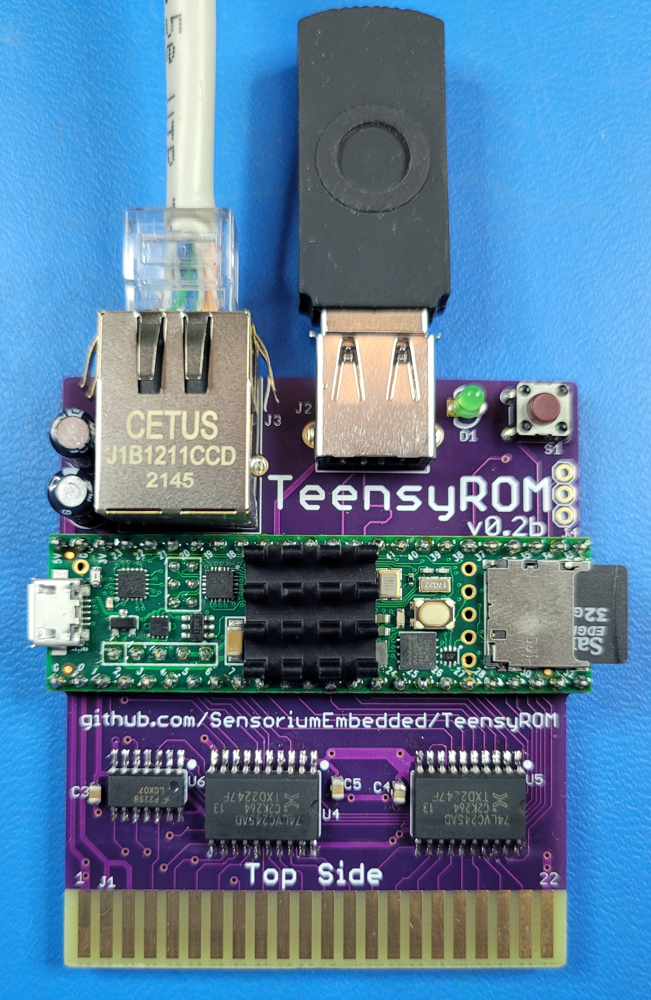
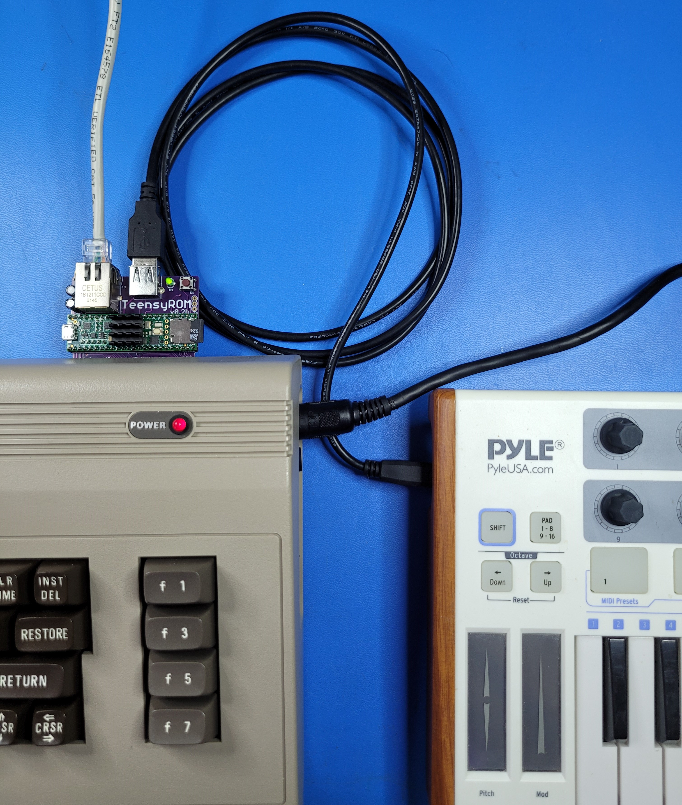
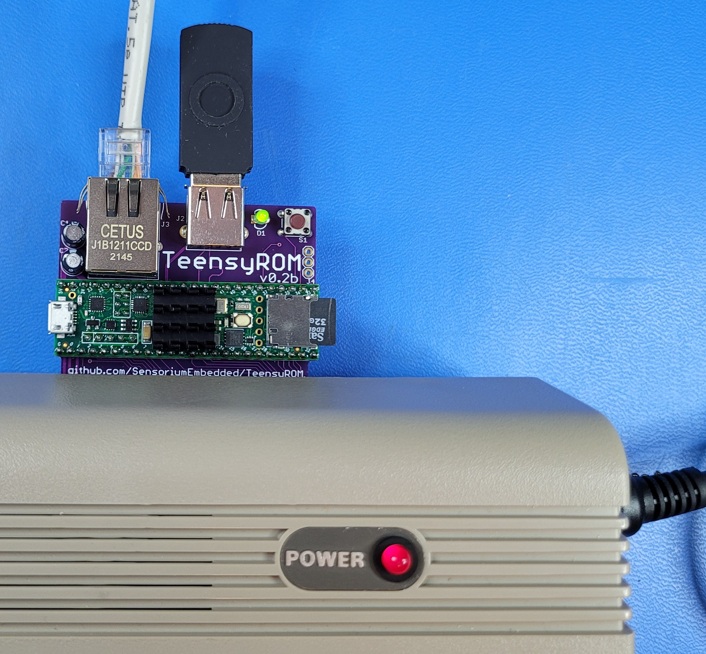

# TeensyROM
**ROM emulator, super fast loader, MIDI and Internet interface cartridge for the Commodore 64 & 128, based on the Teensy 4.1**

*Design by Travis S/Sensorium ([e-mail](mailto:travis@sensoriumembedded.com))* 

Although there other emulators/loaders out there, I really wanted to design one around the Teensy 4.1 to take advantage of all its external interface capabilities (USB Host, SD card, Ethernet).  I also wanted to use its many IO pins to do "direct" interfacing so it can be largely software defined. 

I'll continue to publish all PCB design files and source code here for anyone else who is interested.   If you have any input on the project, features you'd like to see, or are interested in trying one out, please send me a note. I'm also interested in any feedback/contributions from other engineers/developers out there.

## Features
### **Super fast load or ROM emulation** directly from:
  * USB thumb Drive
  * SD card
  * Teensy Internal Flash Memory
  * Transfer directly from PC
    * C# Windows app included
### **MIDI in/out via USB Host connection:** 
  * Play your SID with a USB MIDI keyboard!
  * Use with popular software such as **Cynthcart, Station64** etc, or the included MIDI2SID app
  * Supports all regular MIDI messages **in and out**
    * Can use your C64 to play a MIDI sound capable device.
  * **Sequential, Datel/Siel, Passport/Sentech, or Namesoft** MIDI cartridges emulated 
  * Use a USB Hub for multiple instruments+thumb drive access
### **MIDI in via USB Device connection:** 
  * Stream .SID or .MIDI files from a modern computer directly to your Commodore machine SID chip!
  * Play MIDI files out of your PC into C64 apps such as Cynthcart or the MIDI2SID app
  * Play .SID files out of your PC using the ASID MIDI protocol to hear any SID file on original hardware.
### **Internet communication via Ethernet connection**
  * Connect to your favorite C64/128 Telnet BBS!
  * Use with released software such as **CCGMS, StrikeTerm2014, DesTerm128,** etc
  * **Swiftlink** cartridge + 38.4k modem emulation
  * Send AT commands from terminal software to configure the Ethernet connection
  * Sets C64 system time from internet

### **Firmware updates directly from SD card or USB thumb drive**
  * Just drop the .hex file on an SD card or USB drive, no need for extra software to update.

### Key parameters stored in internal EEPROM
  * Startup, Ethernet, timezone, etc retained after power down.

## Links to documentation
  * **Usage Documentats**
    * **[General Usage document](docs/General_Usage.md)**
    * **[MIDI Usage document](docs/MIDI_Usage.md)**
    * **[Ethernet Usage document](docs/Ethernet_Usage.md)**
  * **Hardware/PCB Related**
    * **[TeensyROM Assembly Instructions](PCB/PCB_Assembly.md)**
    * **[PCB Design History](PCB/PCB_History.md)**
    * **[Bill of materials with cost info](PCB/v0.2%20archive/TeensyROM%20v0.2b%20BOM.xlsx)**
    * **[PDF Schematic](PCB/v0.2%20archive/TeensyROM_v0.2b_Schem.pdf)**
  * **Code developnment/modification**
    * **[Software Build Instructions](Source/BuildInfo.md)**

 

  
## Demo Videos:
  * [TeensyROM real-time video/audio capture](https://www.youtube.com/watch?v=RyowR9huh0A) of menu navigation and loading/running/emulating various programs/cartridges
  * [Demo using Cynthcart and Datel MIDI emulation](https://www.youtube.com/watch?v=-LumhU60d_k) to play with a USB keyboard 
  * [MIDI2SID Demo ](https://www.youtube.com/watch?v=3BsX_jxIYKY) using MIDI keyboard => TeensyROM => C64/SID

## Hardware/PCB Design
**PCB design is fully validated and tested.** 

Component selection was done using parts large enough (SOIC and 0805s at the smallest) that any soldering enthusiast should be able to assemble themselves.   Since high volume production isn't necessarily the vision for this device, 2 sided SMT was used to reduce the PCB size while still accommodating larger IC packages.

**A note about overclocking**
The Teensy 4.1 is slightly "overclocked" to 816MHz from FW in this design. Per the app, external cooling is not required for this speed.  However, in abundance of caution, a heatsink is specified in the BOM for this project.  In addition, the temperature can be read on the setup screen of the main TeensyROM app. The max spec is 95C, and there is a panic shutdown at 90C.  In my experience, even on a warm day running for hours with no heatsink, the temp doesn't excede 75C.

## Compatibility
* TeensyROM been tested on many different NTSC C64, C64C, and C128 machines, and several PAL C64 machines to this point. 

## Future/potential SW development/features:
* More Special HW cartridge emulation
* .d64, .tap file support
* Host USB Printers

## Inspiration:
* **Heather S**: Loving wife through whom all things are possible
* **Paul D**: Thought provoker, Maker, and Beta tester extraordinaire
* **Giants with tall shoulders**: SID/SIDEKick, KungFu Flash, VICE
* **Frank Z**: Music is The Best.

## Pictures/screen captures:
| | | 
|:--:|:--:|
| |  |
|||
|||

See the [media](https://github.com/SensoriumEmbedded/TeensyROM/tree/main/media) folder for more, including some oscilloscope shots showing VIC cycle timing.

